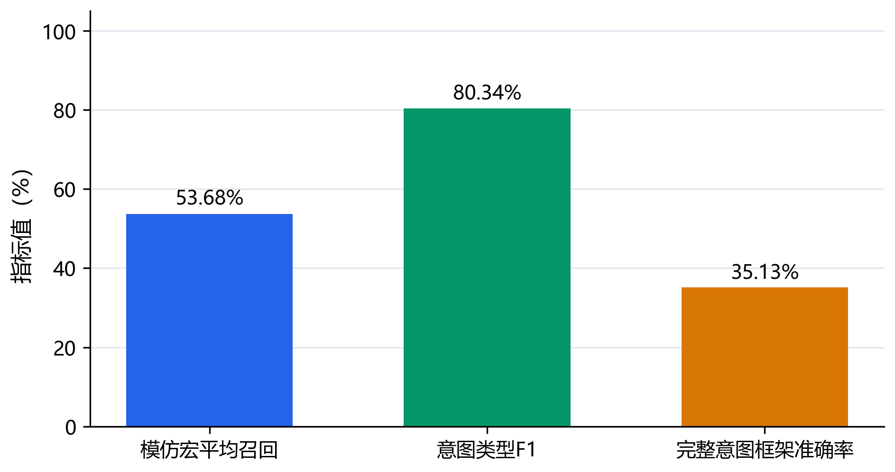
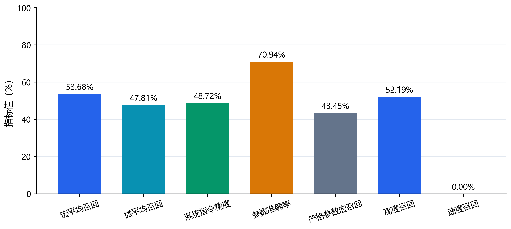
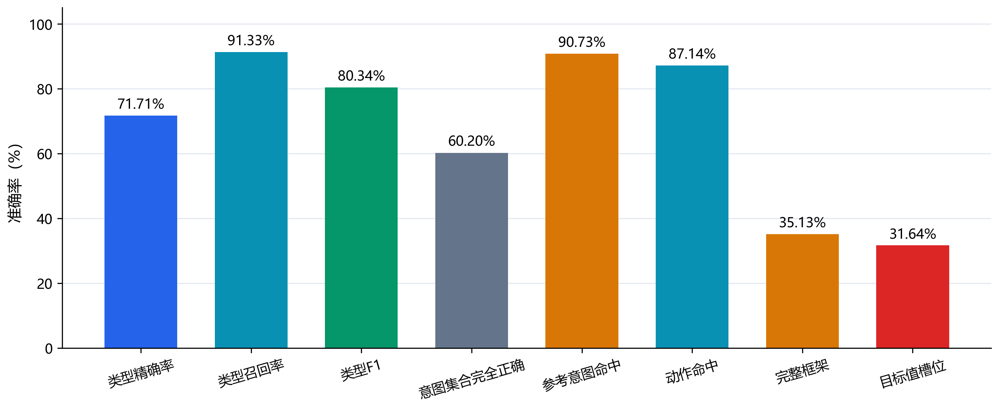

# 本周指标评估结果（2026-08-10）

本周完成管制员指令模仿精度全日冻结回放，以及500条管制话语意图识别结果重算。

## 汇报结论

- 管制员指令模仿宏平均召回：**53.68%**；
- 意图类型识别F1：**80.34%**；
- 意图类型精确率 / 召回率：**71.71% / 91.33%**；
- 参考意图命中率（旧口径）：**90.73%**；
- 完整意图框架准确率：**35.13%**。

> 本周建议把“识别准确率”汇报为意图类型F1 80.34%。90.73%只表示参考意图命中率，没有惩罚多报；当前综合平台的严格完整框架口径为35.13%。

## 可视化

### 指标总览



### 管制员指令模仿精度分项



### 管制意图识别分项



## 评估范围

| 项目 | 管制员指令模仿精度 | 管制意图识别 |
|---|---:|---:|
| 测试规模 | 21,600 tick | 500条话语 / 669个意图 |
| 参考数量 | 799条历史指令 | 500条固化参考标注 |
| 系统输出 | 784条指令 | 500条预测 |
| 数据范围 | 2025-07-02上海进近冻结历史态势 | 管制指令文本，不含ASR |

## 模仿精度分项

| 指标 | 结果 |
|---|---:|
| 宏平均召回 | 53.68% |
| 微平均召回 | 47.81% |
| 系统指令精度 | 48.72% |
| 匹配后参数准确率 | 70.94% |
| 严格参数宏平均召回 | 43.45% |
| 高度指令召回 | 52.19% |
| 速度指令召回 | 0.00% |

当前系统输出全部为高度指令，因此速度指令召回仍为0%，这是下一阶段最明确的改进点。

## 意图识别分项

| 指标 | 结果 |
|---|---:|
| 意图类型精确率 | 71.71% |
| 意图类型召回率 | 91.33% |
| 意图类型F1 | 80.34% |
| 话语级意图集合完全正确率 | 60.20% |
| 参考意图命中率（不惩罚多报） | 90.73% |
| 动作命中率 | 87.14% |
| 完整意图框架准确率 | 35.13% |
| 呼号槽位准确率 | 76.97% |
| 目标值槽位准确率 | 31.64% |
| 单位槽位准确率 | 47.27% |

意图类型召回较高，但额外预测导致精确率只有71.71%；目标值、单位、频率、跑道及进近类型等参数槽位进一步限制了完整框架准确率。

## 结果边界

- 模仿精度是冻结历史态势离线回放的一致性，不是真实同场景复现或运行安全证明。
- 意图类型准确率衡量大类识别；完整意图框架准确率还要求动作与必需参数槽位正确。
- 意图类型F1同时惩罚漏检和多报；90.73%的参考意图命中率不惩罚额外预测，不能单独作为正式准确率。
- 意图评估不包含语音识别误差，参考标注尚不能宣称为独立人工双盲金标准。

## 复现

图表从同目录 `metrics_summary.json` 自动生成，原始数据、模型权重和逐条预测不进入Git仓库。

```powershell
python .\figures\gen_fig1_headline_metrics.py
python .\figures\gen_fig2_imitation_breakdown.py
python .\figures\gen_fig3_intent_breakdown.py
```
